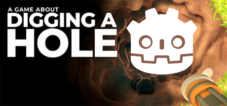

# A Game About Digging a Hole – Godot Edition

  
*Low-poly / voxel-based digging game made with Godot 4.4 and Zylann's Voxel Plugin*

---

## 📖 Overview

This project is a voxel-based 3D digging game inspired by *A Game About Digging a Hole*. The player digs through a procedurally generated world, collects ores and resources, upgrades equipment, and digs deeper.

The game uses Godot 4.4 and the `godot-voxel` addon by Zylann for performant voxel terrain generation. The visual style is deliberately low-poly / voxel for clarity and performance.

---

## 🎯 Features (planned / implemented)

- Procedural voxel terrain with multiple block types  
- Digging mechanic using raycast and dynamic block removal  
- Resources like coal, iron, crystals with varying rarity  
- Player with third-person controls, jetpack, physics-based movement  
- Upgrade system for jetpack fuel, digging speed, inventory size  
- Full inventory system with item collection and management  
- HUD displaying fuel, depth, inventory, and objectives  
- Save/load system for game progress  
- Start menu, pause menu, and settings  
- Low-poly / voxel art style optimized for desktop
